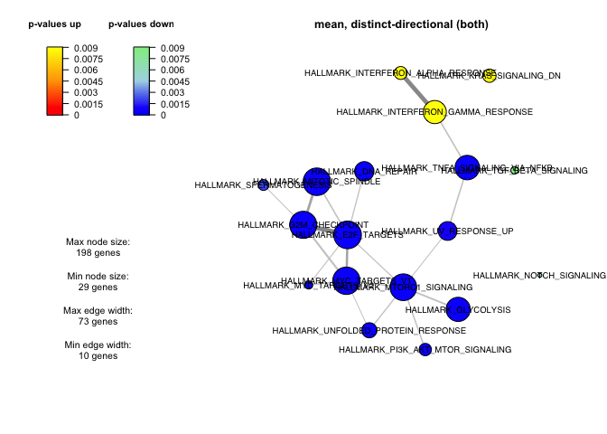
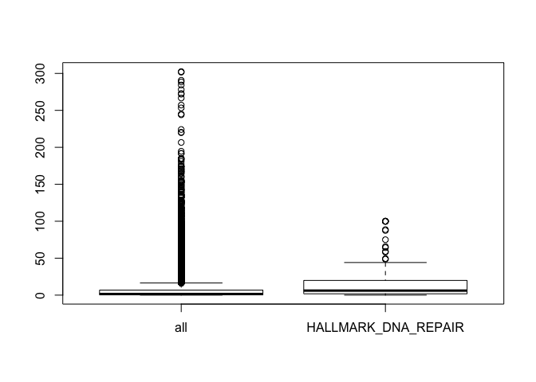

---		
layout: default		
title: 'Gene-set analysis'		
---		

# Gene-set analysis

### Introduction and data

The follwing packages are used in this tutorial: `DESeq2`, `biomaRt`, `piano`, `snow`, `snowfall`. In case you haven't installed them yet it could be convenient to do so before starting (you can potentially skip `snow` and `snowfall`). We will perform gene-set analysis on the output from the tutorial on Differential expression analysis of RNA-seq data using DESeq. A quick recap of the essential code for the differential expression analysis is included below, in case you did not save the output from that analysis:

```
library(DESeq2)
counts <- read.delim("count_table.txt")
samples <- data.frame(timepoint = rep(c("ctrl", "t2h", "t6h", "t24h"), each=3))
ds <- DESeqDataSetFromMatrix(countData=counts, colData=samples, design=~timepoint)
colnames(ds) <- colnames(counts)
ds <- DESeq(ds)
res <- results(ds, c("timepoint","t24h","ctrl"))
res <- res[ ! (is.na(res$pvalue) | is.na(res$padj)), ]
# Here we also exclude genes with adjusted p-values = NA
```

Let's save the information we need (fold-changes and adjusted p-values):

```
geneLevelStats <- as.data.frame(res[,c("log2FoldChange","padj")])
```

It will be handy to have the gene names along with the Ensembl IDs, so let's fetch them:

```
library(biomaRt) # Install the biomaRt package (Bioconductor) if this command does not work

# Get the Ensembl ID to gene name mapping:
mart <- useMart("ENSEMBL_MART_ENSEMBL", dataset = "hsapiens_gene_ensembl", host="www.ensembl.org")
ensembl2name <- getBM(attributes=c("ensembl_gene_id","external_gene_name"),mart=mart)

# Merge it with our gene-level statistics:
geneLevelStats <- merge(x=geneLevelStats, y=ensembl2name, by.x=0, by.y=1, all.x=TRUE)
colnames(geneLevelStats) <- c("ensembl","log2fc","padj","gene")
rownames(geneLevelStats) <- geneLevelStats[,1]

# Sort the gene-level statistics by adjusted p-value:
geneLevelStats <- geneLevelStats[order(geneLevelStats$padj),]
```

This is how the table looks now:

```
head(geneLevelStats)
```

    ##                         ensembl    log2fc          padj    gene
    ## ENSG00000104738 ENSG00000104738 -2.210535  0.000000e+00    MCM4
    ## ENSG00000118849 ENSG00000118849  3.550871  0.000000e+00 RARRES1
    ## ENSG00000163283 ENSG00000163283  4.318265  0.000000e+00    ALPP
    ## ENSG00000171848 ENSG00000171848 -2.717818  0.000000e+00    RRM2
    ## ENSG00000182481 ENSG00000182481 -2.062894  0.000000e+00   KPNA2
    ## ENSG00000110092 ENSG00000110092 -2.469861 2.849282e-302   CCND1

If you are using RStudio you can also use the command `View` to inspect the data:

```
View(geneLevelStats)
```

**Question:** How many genes are in this dataset and how many are significant at an FDR&lt;1e-3?

**Question:** Are there any duplicates among the gene names?

### Overrepresentation analysis

First we can look if there is any common function (or other property) of the top 100 genes:

```
# This command copies the top 100 genes to the clipboard so you can paste it
# anywhere (Windows only)
writeClipboard(geneLevelStats[1:100,"gene"])

# You can also manually select and copy the genes:
write.table(geneLevelStats[1:100,"gene"],row.names=F,col.names=F,quote=F)
```

Paste this gene list at <http://amp.pharm.mssm.edu/Enrichr/> and submit, go to the tab Pathways and Kinase Perturbations from GEO up. You will see that EGFR\_drugactivation is the top significant hit.

**Question:** Does this make sense considering what you know about the experiment behind the data?

Explore the other result options on the Enrichr webiste.

**Question:** What seems to be the main functions of the top 100 genes?

Now, try a new run of Enrichr, but this time on the top 200 genes (or choose your own cutoff).

**Question:** Do the results look similar?

If you want to, also try out DAVID. Go to the [*Functional Annotation* page](https://david.ncifcrf.gov/summary.jsp) and make sure the Upload tab is visible. Paste the copied gene-list, select the correct identifier, and select whether this is a gene list or background (discuss with other students if you are not sure, or ask the instructors). Submit list.

**Question:** Were all gene IDs recognized?

Explore the results. For instance, click on Functional Annotation Clustering at the bottom of the page. This shows related gene-sets clustered together in larger groups for a nicer overview.

**Question:** Are the results similar to those from Enrichr?

### Gene-set analysis

Looking at only the top 100 genes (or genes with a adjusted p-value below some cutoff) has the drawback of excluding a lot of information. Gene-set analysis (GSA) takes into account the "scores" (which can be e.g. p-values, fold-changes, etc) of all genes. This allows us to also detect small but coordinate changes converging on specific biological functions or other themes. In this tutorial we will use the piano package to perform GSA:

```
library(piano) # Install the piano package (Bioconductor) if this command does not work
```

First we need to construct our gene-set collection, we will be looking at so called Hallmark gene-sets from the MSigDB in this example (see this [paper](http://www.cell.com/cell-systems/abstract/S2405-4712(15)00218-5)). Download the Hallmark gene-set collection from [here](http://software.broadinstitute.org/gsea/msigdb/download_file.jsp?filePath=/resources/msigdb/5.1/h.all.v5.1.symbols.gmt). Note that you need to sign up with an email adress to gain access. Visit [this link](http://software.broadinstitute.org/gsea/msigdb/collections.jsp#H) if the first link does not work.

```
# Load the gene-set collection into piano format:
gsc <- loadGSC("h.all.v6.1.symbols.gmt", type="gmt") # Check that the filename matches the file that you downloaded
gsc # Always take a look at the GSC object to see that it loaded correctly
```

    ## First 50 (out of 50) gene set names:
    ##  [1] "HALLMARK_TNFA_S..." "HALLMARK_HYPOXI..." "HALLMARK_CHOLES..."
    ##  [4] "HALLMARK_MITOTI..." "HALLMARK_WNT_BE..." "HALLMARK_TGF_BE..."
    ##  [7] "HALLMARK_IL6_JA..." "HALLMARK_DNA_RE..." "HALLMARK_G2M_CH..."
    ## [10] "HALLMARK_APOPTO..." "HALLMARK_NOTCH_..." "HALLMARK_ADIPOG..."
    ## [13] "HALLMARK_ESTROG..." "HALLMARK_ESTROG..." "HALLMARK_ANDROG..."
    ## [16] "HALLMARK_MYOGEN..." "HALLMARK_PROTEI..." "HALLMARK_INTERF..."
    ## [19] "HALLMARK_INTERF..." "HALLMARK_APICAL..." "HALLMARK_APICAL..."
    ## [22] "HALLMARK_HEDGEH..." "HALLMARK_COMPLE..." "HALLMARK_UNFOLD..."
    ## [25] "HALLMARK_PI3K_A..." "HALLMARK_MTORC1..." "HALLMARK_E2F_TA..."
    ## [28] "HALLMARK_MYC_TA..." "HALLMARK_MYC_TA..." "HALLMARK_EPITHE..."
    ## [31] "HALLMARK_INFLAM..." "HALLMARK_XENOBI..." "HALLMARK_FATTY_..."
    ## [34] "HALLMARK_OXIDAT..." "HALLMARK_GLYCOL..." "HALLMARK_REACTI..."
    ## [37] "HALLMARK_P53_PA..." "HALLMARK_UV_RES..." "HALLMARK_UV_RES..."
    ## [40] "HALLMARK_ANGIOG..." "HALLMARK_HEME_M..." "HALLMARK_COAGUL..."
    ## [43] "HALLMARK_IL2_ST..." "HALLMARK_BILE_A..." "HALLMARK_PEROXI..."
    ## [46] "HALLMARK_ALLOGR..." "HALLMARK_SPERMA..." "HALLMARK_KRAS_S..."
    ## [49] "HALLMARK_KRAS_S..." "HALLMARK_PANCRE..."
    ##
    ## First 50 (out of 4386) gene names:
    ##  [1] "JUNB"     "CXCL2"    "ATF3"     "NFKBIA"   "TNFAIP3"  "PTGS2"   
    ##  [7] "CXCL1"    "IER3"     "CD83"     "CCL20"    "CXCL3"    "MAFF"    
    ## [13] "NFKB2"    "TNFAIP2"  "HBEGF"    "KLF6"     "BIRC3"    "PLAUR"   
    ## [19] "ZFP36"    "ICAM1"    "JUN"      "EGR3"     "IL1B"     "BCL2A1"  
    ## [25] "PPP1R15A" "ZC3H12A"  "SOD2"     "NR4A2"    "IL1A"     "RELB"    
    ## [31] "TRAF1"    "BTG2"     "DUSP1"    "MAP3K8"   "ETS2"     "F3"      
    ## [37] "SDC4"     "EGR1"     "IL6"      "TNF"      "KDM6B"    "NFKB1"   
    ## [43] "LIF"      "PTX3"     "FOSL1"    "NR4A1"    "JAG1"     "CCL4"    
    ## [49] "GCH1"     "CCL2"    
    ##
    ## Gene set size summary:
    ##    Min. 1st Qu.  Median    Mean 3rd Qu.    Max.
    ##    32.0    98.0   180.5   146.5   200.0   200.0
    ##
    ## No additional info available.

Now we are ready to run the GSA:

```
library(snowfall); library(snow) # Install snow and snowfall (CRAN) if you want to
# run on multiple cores, otherwise omit the ncpus argument below in the call to runGSA
padj <- geneLevelStats$padj
log2fc <- geneLevelStats$log2fc
names(padj) <- names(log2fc) <- geneLevelStats$gene
gsaRes <- runGSA(padj, log2fc, gsc=gsc, ncpus=8)
```

    ## Checking arguments...done!
    ## Calculating gene set statistics...done!
    ## Calculating gene set significance...done!
    ## Adjusting for multiple testing...done!

The runGSA function uses the adjusted p-values to score the genes and the log2-foldchange for information about the direction of change.

We can visualize the results in different ways, for instance using a network plot showing the significant gene-sets and the overlap of genes between sets:

```
networkPlot(gsaRes, "distinct", "both", adjusted=T, ncharLabel=Inf, significance=0.01,
            nodeSize=c(3,20), edgeWidth=c(1,5), overlap=10,
            scoreColors=c("red", "orange", "yellow", "blue", "lightblue", "lightgreen"))
```



```
par(mfrow=c(1,1)) # Reset the plotting layout
```

**Question:** Understand the plot! What do the node sizes mean, what do the edges and edge sizes mean? Hint: take a look at `?networkPlot`.

The function `GSAsummaryTable` can be used to export the complete results.

```
View(GSAsummaryTable(gsaRes)) # in RStudio
# otherwise:
head(GSAsummaryTable(gsaRes))
# if you want to you can also save this as a file:
GSAsummaryTable(gsaRes, save=T, file="gsares.txt")
```

**Question:** Are the results similar to those from Enrichr and/or DAVID?

The `geneSetSummary` function can be used to explore specific gene-sets in more detail.

```
geneSetSummary(gsaRes, "HALLMARK_DNA_REPAIR")
```

For instance, we can make a boxplot of the -log10(adjusted p-values) of the genes in the gene-set HALLMARK\_DNA\_REPAIR and compare that to the distribution of all genes:

```
boxplot(list(-log10(geneLevelStats$padj),
             -log10(geneSetSummary(gsaRes,"HALLMARK_DNA_REPAIR")$geneLevelStats)),
        names=c("all","HALLMARK_DNA_REPAIR"))
```



**Question:** Given the significance of the genes, does it make sense that DNA-repair shows up as significant?

From here, you can dig in to the results on the gene-set level further and start making hypothesis of what is happening with the biology behind your data. You can also try to run GSA with other gene-set collections (e.g. from [MSigDB](http://software.broadinstitute.org/gsea/msigdb/)) or using another GSA method (see `?runGSA`).

### Further reading

-   Piano webpage, with more information and link to publication: <http://www.sysbio.se/piano>
-   GSEA paper: <http://www.pnas.org/content/102/43/15545.full>
-   A couple of reviews:
-   <http://bib.oxfordjournals.org/content/9/3/189.full>
-   <http://bmcbioinformatics.biomedcentral.com/articles/10.1186/1471-2105-10-47>
